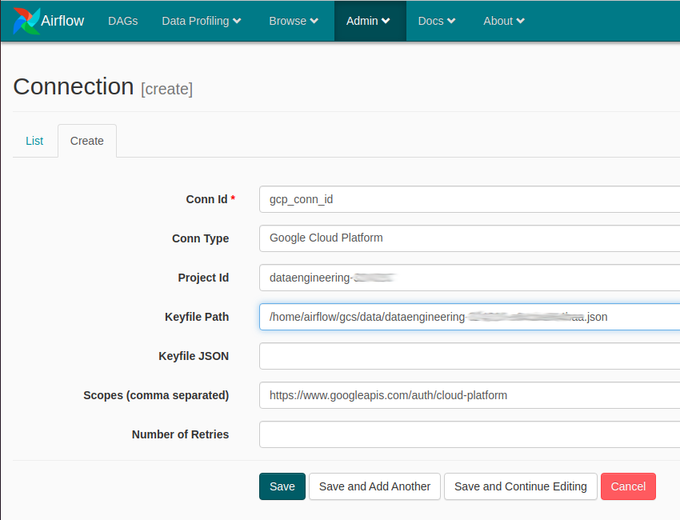

# Pipeline olist brazilian e-comerce : GCP
<table >
    <tr>
        <th style="background-color:#FFFFFF;">
            
        </th>
        <th style="background-color:#FFFFFF;">
            
        </th>
    </tr>
    <tr>
        <th style="background-color:#FFFFFF;">
            
        </th>
        <th style="background-color:#FFFFFF;">
            
        </th>
    </tr>
</table>
## Sobre o projeto

Esse projeto demonstra uma solução para processamento batch, utilizando estrutura de processamento de dados em nuvem da Google, o Google Cloud Platform . O projeto consiste na leitura e processamentos das informações de e-commerce Brasileira, disponivel em https://www.kaggle.com/olistbr/brazilian-ecommerce?select=olist_customers_dataset.csv, fornecidas pela olist www.olist.com .

## Olist dataset

O conjunto de dados tem informações de 100 mil pedidos de 2016 a 2018 feitos em vários mercados no Brasil

Abaixo temos o diagrama de dados do dataset

As informações de geolocalização não são utilizadas nesse projeto

 - olist_customers_dataset.csv
 - olist_order_items_dataset.csv
 - olist_order_payments_dataset.csv
 - olist_order_reviews_dataset.csv
 - olist_orders_dataset.csv
 - olist_products_dataset.csv
 - olist_sellers_dataset.csv
 

## Google Cloud Platform

O google cloud platform oferece inumeros serviços para computação em nuvem, muitos desses serviços são versões dos já tradicionais  pŕodutos open source de processamento de dados. Esse tutorial exemplifica o uso de alguns desses produtos em conjunto, criando um processo de ETL (extração ,transformação e carga de dados) automatizando todas as etapas desse processo e finalizando com a ingestão dos dados processados num banco de dados analitico. 

## Serviços utilizados.

  - Cloud Composer
  - Dataflow
  - Cloud Storage
  - BigQuery

É necessário ativar as APIs Cloud Composer, Dataflow, Cloud Storage, BigQuery.

Um ponto de atenção é que todos os serviços tem um custo, então após finalizar os testes, se o projeto não for em produção, para evitar custos adicionais, é importante apagar o ambiente do composer, os buckets do storage e o dataset do Big query utilizado, uma solução para testes é usar os créditos gratuítos fornecidos quando uma nova conta é criada.

## Arquitetura da solução

## Configuração do ambiente

### Cloud Storage

A arquitetura proposta, utiliza o google storage para armazenar os arquivos de entrada de dados, o arquivo com os dados transformados, armazenamento do arquivo template e espaço temporário para o Dataflow, assim é necessário criar um bucket e suas sub divisões .

Criar bucket :

gsutil mb -p dataengineering-324315 -c STANDARD	 -l us-east1 -b on gs://olist_etl

Após a criação do bucket, é necessário criar as seguintes pastas no bucket

 - classic_template
 - data
 - olist
 - staging
 - temp
 
Os arquivos csv devem ser armazenados dentro da pasta data. 
Para criar as pastas e fazer o upload dos arquivos , utilize os botões criar pasta e fazer upload de arquivos, exibidos na imagem abaixo

### Conta de serviço 

É necessário uma conta de serviço com alguns papéis para a execução de todos os itens envolvidos, como a execução do Pipeline pelo composer , o processamento dos dados pelo google Dataflow ou a ingestão dos dados no Big Query.

Os comandos abaixo criam uma conta de serviço e em seguida adicionam os papéis necessários .

criar conta de serviço: 

gcloud iam service-accounts create data-engineering-account --display-name="data-engineering-account" \
--description "descricao conta de servico"

Após a criação da Role, é necessário adicionar os papéis necessários .

 - dataflow.worker 
 - composer.admin 
 - composer.worker 
 - storage.admin 
 - iam.serviceAccountUser 
 - bigquery.jobUser 
 - bigquery.dataEditor
 
A service account criada tem um formato semelhante ao demonstrado abaixo, formado pelo nome informado no momento da criação + @ + ID_PROJETO + .iam.gserviceaccount.com, assim se eu informei para o nome da conta de serviço data-engineering-composer, com o id do projeto dataengineering-324100, a conta terá esse formato :

data-engineering-composer@dataengineering-324100.iam.gserviceaccount.com

Exemplo do comando para adicionar o papel dataflow.worker

gcloud projects add-iam-policy-binding  dataengineering-324100 \
    --member=serviceAccount:data-engineering-composer@dataengineering-324100.iam.gserviceaccount.com \
    --role=roles/dataflow.worker

 
Os comandos abaixo adicionam os papéis acima para a conta de serviço criada, é necessário informar o ID do projeto do Google Cloud Platform utilizado e conta de serviço criada.

gcloud projects add-iam-policy-binding  ID_PROJETO \
    --member=serviceAccount:NOME_CONTA@ID_PROJETO.iam.gserviceaccount.com \
    --role=roles/dataflow.worker
    
gcloud projects add-iam-policy-binding  ID_PROJETO \
    --member=serviceAccount:NOME_CONTA@ID_PROJETO.iam.gserviceaccount.com \
    --role=roles/composer.admin
    
gcloud projects add-iam-policy-binding  ID_PROJETO \
    --member=serviceAccount:NOME_CONTA@ID_PROJETO.iam.gserviceaccount.com \
    --role=roles/composer.worker
    
    
gcloud projects add-iam-policy-binding  ID_PROJETO \
    --member=serviceAccount:NOME_CONTA@ID_PROJETO.iam.gserviceaccount.com \
    --role=roles/storage.admin
    
gcloud projects add-iam-policy-binding  ID_PROJETO \
    --member=serviceAccount:NOME_CONTA@ID_PROJETO.iam.gserviceaccount.com \
    --role=roles/iam.serviceAccountUser    
    
    
gcloud projects add-iam-policy-binding  ID_PROJETO \
    --member=serviceAccount:NOME_CONTA@ID_PROJETO.iam.gserviceaccount.com \
    --role=roles/bigquery.jobUser  
    
    
gcloud projects add-iam-policy-binding  ID_PROJETO \
    --member=serviceAccount:NOME_CONTA@ID_PROJETO.iam.gserviceaccount.com \
    --role=roles/bigquery.dataEditor
    
Após a criação da conta de serviço e a adição dos papéis necessários, é necessário a criação de uma chave para utilização posterior .

### Criação da chave de segurança

Acesse IAM e administrador, acesse a opção contas de serviço, ações na conta criada e selecione **"Gerenciar chaves"  

Acesse chave , adicionar nova chave , JSON e criar, o donwload da nova chave acontece automaticamente. 

    
Para saber mais, consulte https://cloud.google.com/iam/docs/creating-managing-service-accounts

### Big Query

Para o Big query, precisamos criar um dataset e criar a tabela no dataset criado. Tanto a criação do dataset quanto a criação da tabela, podem ser realizadas de inumeras formas, como interface gráfica , linha de comando, programação, abaixo temos a utilização da linha de comando .

#### Criação do dataset

Abaixo utilizaremos o data_analysis como nome do dataset.

Propriedades do dataset :

 - location
 - default_table_expiration
 - description
onde:
    location é a localização escolhida para a criação do dataset
    default_table_expiration é o tempo de duração das tabelas criadas, caso deseje que a tabela não seja descartada, utilize 0, o default para esse parametro é 3600 minutos.
    description descrição do dataset, parametro opcional.
    
bq --location=us-east1 mk -d --default_table_expiration 0  --description "descricao do dataset" data_analysis

#### Criação da tabela no dataset

O nome utilizado para o dataset é data_analysis e para a tabela olist_analitycs, no momento da criação da tabela, informar o dataset + . + tabela, no exemplo utilizado  data_analysis.olist_analitycs

Propriedades da tabela do big query

 - schema arquivo json contendo o formato da tabela, nome dos campos, tipo de dados.
 - time_partitioning_field caso a tabela seja particionada, informar o campo de data para a partição
 
bq mk -t --schema schema.json --time_partitioning_field partition_date data_analysis.olist_analitycs 

O script create_tables.sh cria o dataset e a tabela no big query. Para executar o script informe os parametros dataset, table, location e description.
Exemplo : ./create_tables.sh data_analysis olist_analitycs us-east1 "descricao dataset"

Para saber mais sobre os datasets do big query, consulte https://cloud.google.com/bigquery/docs/datasets

### Criação do template classico do Dataflow

O google cloud platform, fornece uma forma de "encapsulamento" de um Pipeline do apache-beam, para execução de diversas maneiras, como API rest ou execução com Airflow.
Para a criação do template do Dataflow, é necessário criar um ambiente python especifico com o apache beam instalado. Esse ambiente é necessário para a criação do template classico, para que o Composer crie os jobs no serviço do Dataflow.

Para saber mais sobre os templates  
https://cloud.google.com/dataflow/docs/guides/templates/creating-templates  
https://cloud.google.com/dataflow/docs/guides/templates/using-flex-templates  

#### Ambiente python 3.7 

sudo apt update
sudo apt install python3 python3-venv
python3 -m pip install --upgrade --force pip
python3 -m venv env37
source env37/bin/activate
pip install wheel
pip install apache-beam[gcp]==2.32.0

Para a criação do template, é necessário ativar o ambiente com o comando 

- source env37/bin/activate

Parametros do template classico

 - runner
 - project
 - region
 - staging_location
 - temp_location
 - template_location
 
Com o ambiente ativado, o comando abaixo cria o template classico

python etl_olist_template.py --runner Dataflow --project dataengineering-324315 --region us-east1 --staging_location gs://olist_etl/staging --temp_location gs://olist_etl/temp --template_location gs://olist_etl/classic_template/etl_olist_template

O script create_template.sh cria o template classico do dataflow.

Exemplo : ./create_template.sh Dataflow dataengineering-324315 us-east1 gs://olist_etl/staging gs://olist_etl/temp gs://olist_etl/classic_template/etl_olist_template

Para saber mais sobre os templates , consulte   
https://cloud.google.com/dataflow/docs/guides/templates/creating-templates

### Criação de ambiente do Composer

Parametros para a criação do ambiente do composer.

 - location localização
 - zone zona da localização
 - machine-type tipo de maquina do cluster
 - image-version versão da imagem do airflow utilizada 
 - disk-size tamanho do disco utilizado nas maquinas do cluster
 - python-version versão do python 
 - service-account conta de serviço utilizado
 - node-count=3 quantidade de máquinas do cluster

gcloud composer environments create airflow-jobs \
--location=us-east1 --zone=us-east1-b --machine-type=n1-standard-1 \
--image-version=composer-1.16.16-airflow-1.10.12 --disk-size=20 --python-version=3 \
--service-account=data-engineering-composer@dataengineering-324315.iam.gserviceaccount.com --node-count=3

Para saber mais sobre o composer, criação de ambientes e outros detalhes, consulte  https://cloud.google.com/composer/docs/quickstart

## Desenvolvimento

### etl_olist_template

O pipeline proposto basicamente le os dados, limpa e organiza os dados e depois faz as operações de soma nos valores e algumas junções entre as coleções, o exemplo de codigo abaixo demonstra isso.

PCollection - Lista de elementos utilizados pelos Pipelines.
Map - Um "Map" aplica uma transformação em cada um dos itens da Pcollection .
CombinePerKey - Agrupa os itens de uma PCollection, aplicando funções como count ou sum.
CoGroupByKey - Faz a junção de duas PColletions em uma nova PCollection, lembra o join do sql .

**função cleandata**

def cleandata(element):  
&nbsp;&nbsp;&nbsp;element = re.sub('\"|\'', '', element)  
&nbsp;&nbsp;&nbsp;thisTuple=element.split(',')  
&nbsp;&nbsp;&nbsp;return thisTuple  
    
1 - Primeiro os dados do arquivo input_itens é carregado, excluindo a primeira linha de cabeçalho.
2 - a função clean data é executada para cada linha dos dados. 

**input_itens_orders = (   
  p1   
    | 'Read itens_orders data' >> beam.io.ReadFromText(opts.input_itens ,skip_header_lines=1)  
    | 'Clean data itens_orders' >> beam.Map(cleandata)   
)**

3 - Cria um dicionario (coleção chave valor),onde o valor é o o item da lista que corresponde ao "price"
4 - Agrupa as chaves iguais, somando os valores de "price"

**itens_sum_price = (  
  input_itens_orders   
    | 'dict for sum prices' >> beam.Map(lambda item:( item[0]+','+item[2] +','+item[3]+','+item[4],float(item[5])))   
    | 'Group sum prices' >> beam.CombinePerKey(sum)  
)**

5 - Cria um dicionario (coleção chave valor)
6 - Agrupa as chaves iguais, countando a quantidade de chaves iguais.

**itens_count = (  
 input_itens_orders   
    |'dict for count itens' >> beam.Map(lambda item:( item[0]+','+item[2] +','+item[3]+','+item[4], int(item[1])))   
    | 'count itens' >> beam.combiners.Count.PerKey()  
)**

7 - Faz a junção das duas PCollections criadas anteriormente, resultando na nova PCollection

**join1 = ({'itens_count': itens_count, 'itens_sum_price': itens_sum_price}   
           | 'itens_count + itens_sum_price' >> beam.CoGroupByKey()     
)**

Para mais detalhes  
https://beam.apache.org/documentation/basics/  
https://beam.apache.org/documentation/programming-guide/#pcollection-characteristics  
https://beam.apache.org/documentation/transforms/python/elementwise/map/  
https://beam.apache.org/documentation/transforms/python/aggregation/combineperkey/  
https://beam.apache.org/documentation/transforms/python/aggregation/cogroupbykey/  

### Airflow Dag

#### O Dag dags_dag_ingestao_olist

O DAG proposto no projeto, contem 3 três operadores : 

 - DataflowTemplatedJobStartOperator  
 Operador para disparar o template do Dataflow
 - GoogleCloudStorageToBigQueryOperator  
 Operador que cria um job de carga de dados do storage para o Big Query
 - BashOperator  
 Operador que executa um comando de shell 

## Implantando a solução

Tela do composer, após a criação do ambiente. 

Para cada ambiente composer criado um bucket é criado com toda a estrutura do composer.  
Os arquivos contendo os pipelines e arquivos de configuração utilizados pelos pipelines devem ser armazenados nas pasta dags.  

Arquivos com chaves de contas de serviço devem ser armazenados na pasta data

O botão airflow, na tela de ambientes do composer, dá acesso a interface de configuração do airflow para o ambiente selecionado.  
Na guia Admin, é necessário criar uma variavel e uma conexão.  

A variavel é informa a configuração utilizada no arquivo conf.cfg , o projeto tem somente a configuração de dev, mas num cenário de produção, outras configurações podem ser adicionadas , como configurações de produção ou homologação.

### Criando a variavel

Na guia Adm, em **variables** , Create e informe a variavel e o valor para a variavel.

Variavel : **ENVIRONMENT**
Valor : dev

### Criando a conexão

Antes de criar a conexão, faça o upload do arquivo contendo a chave de segurança, para a pasta data, do bucket do ambiente composer criado, conforme mencionado anteriormente.  

Na guia Adm, em **Connection** , Create e informe os valores solicitados, o campo Conn Type é uma caixa de seleção com varios tipos de conexão diferentes. O campo Keyfile Path, é o caminho para a chave armazenada /home/airflow/gcs/data/MINHA_CHAVE.json  

O valor para o campo scope, no proejto é https://www.googleapis.com/auth/cloud-platform

### DAG 

#### Arquivo de configuração config.cfg

Antes de realizar o upload do Dag e do arquivo config.cfg, modifique o valor para as propriedades project, service_account_email, gcp_conn_id,template,bucket e o caminho para o bucket onde os arquivos de entrada de dados foram armazenados.  
A estrutura de pastas do bucket criado segue a estrutura abaixo, caso o nome do bucket seja alterado, o arquivo config.cfg deve ser alterado para refletir as mudanças.

 - olist_etl
   - classic_template
   - data
   - olist
   - staging
   - temp

Após a configuração dos parametros no arquivo config.cfg e o upload do dag dags_dag_ingestao_olist.py config.cfg para a pasta dags do ambiente do Composer, a interface web do composer deve ficar como abaixo : 

É possivel iniciar a execução do DAG em qualquer momento utilizando o botão "Trigger DAG"  
Na imagem abaixo, quatro execuções são exibidas, as três primeiras com erro e a ultima com sucesso.  
O Dag proposto só continua a execução quando a etapa anterior é concluida com exito

A execução do job dataflow disparado pelo composer, pode ser verificado no servido do Dataflow

Nesse momento, os dados estão disponíveis para consulta ou analise, no Big Query, acessando a guia visualizar é possivel ter uma amostras dos dados sem custo de consulta 

## Links

- Página do projeto: https://github.com/jader-lima/pipeline_airflow_dataflow

- Projetos relacionados:
  - Airflow : https://airflow.apache.org/
  - Apache Beam : https://beam.apache.org/
  - OlistDataset : https://www.kaggle.com/olistbr/brazilian-ecommerce?select=olist_customers_dataset.csv
  
 ## Autor
 
* **jader-lima**: (https://github.com/jader-lima)

